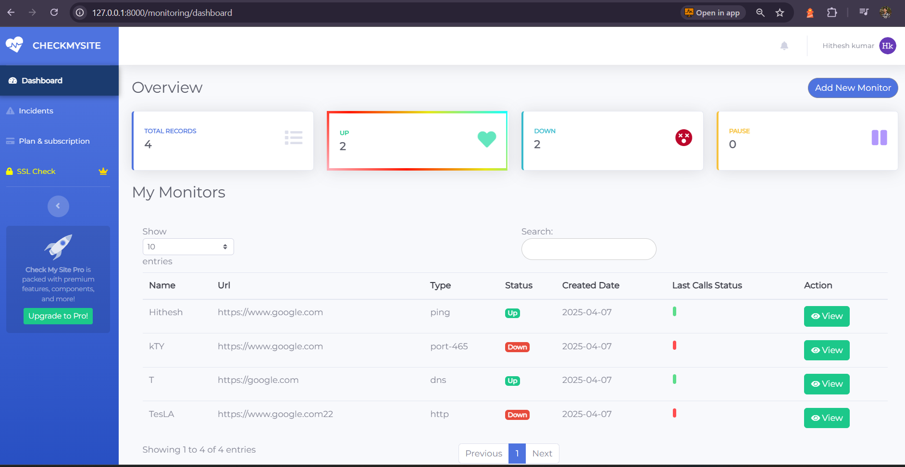
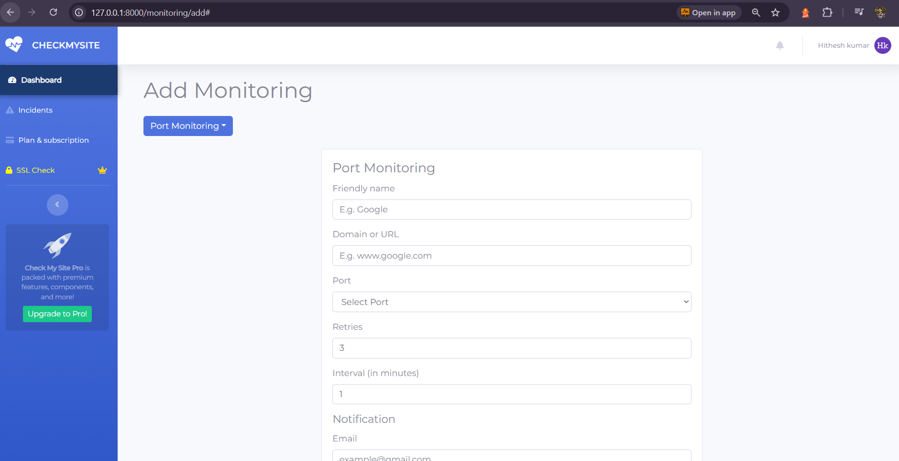
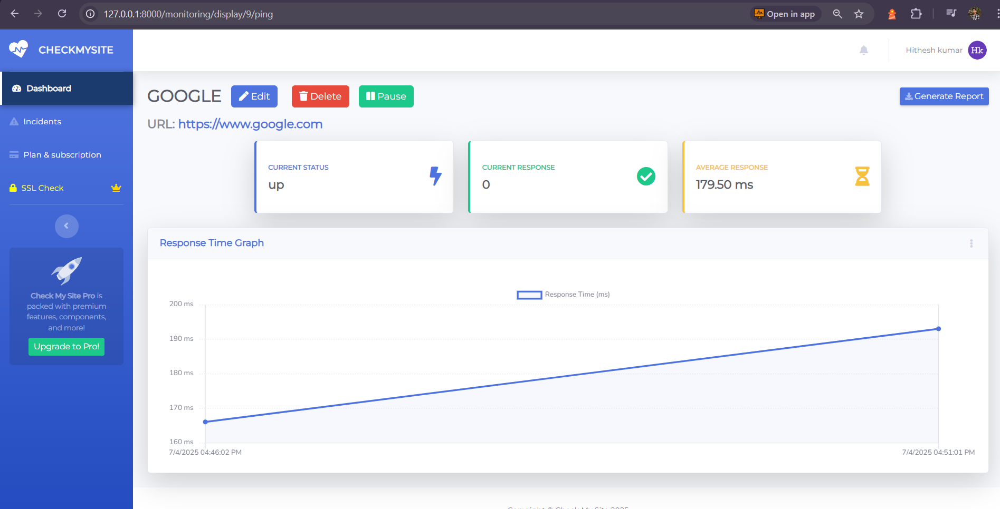
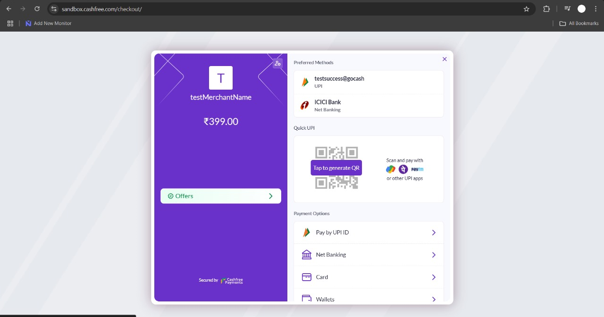

# 🚀 Uptime Monitoring System

A robust Laravel-based solution for monitoring website availability, SSL certificates, and server status with real-time alerts.

## 🌟 Features

### 🖥 Monitoring
- HTTP/HTTPS status checks
- DNS record validation
- Ping availability testing
- Port scanning
- SSL certificate expiration tracking

### 🔔 Notifications
- Email alerts (SMTP)
- Telegram bot integration

### 💳 Payment Integration  
- Subscription-based plans (Free/Premium)  
- Integrated **Cashfree** payment gateway for seamless transactions  


### 👤 User Management
- Multi-tier authentication (Free/Premium)
- Role-based dashboard access

## 🔑 User Access Levels
- **Free Tier**: Up to 5 monitors, email + Telegram alerts, priority support.
- **Premium Tier**: Unlimited monitors, email + Telegram alerts, priority support.

### 📊 Dashboard
- Real-time status charts (Chart.js)
- Historical uptime statistics
- Incident timeline

## **🛠 Tech Stack**  
- **Frontend**: Blade, Bootstrap  
- **Backend**: Laravel, MySQL  
- **Monitoring**:chart.js  
- **Logging**: Spatie Laravel Activity Log  
---

## **📌 Installation**  

1️⃣ **Clone the Repository**  
```bash
git clone https://github.com/your-username/uptime-monitoring.git
cd uptime-monitoring
```

2️⃣ **Install Dependencies**  
```bash
composer install
npm install
```

3️⃣ **Setup Environment**  
```bash
cp .env.example .env
php artisan key:generate
```
Edit `.env` and configure **database credentials**.

4️⃣ **Run Migrations**  
```bash
php artisan migrate
```

5️⃣ **Seed Data (Optional)**  
```bash
php artisan db:seed
```

6️⃣ **Start Development Server**  
```bash
php artisan serve
```
💰 Setting Up Cashfree Payments
---
1️⃣ **Register on Cashfree and obtain your API keys.**  
Update .env with the following:
```bash
CASHFREE_API_KEY=
CASHFREE_API_SECRET=
```
## 📸 Snapshots  

### 📍 **Dashboard**  
<!--    -->


### 🔍 **Monitor List**  
<!--    -->


### 📉 **Historical Uptime Graph**  
<!--    -->


### 💳 **Cashfree Payment Integration**  
<!--    -->




---

## **📢 Contributing**  
Contributions are welcome! Feel free to open issues or submit pull requests.  

---